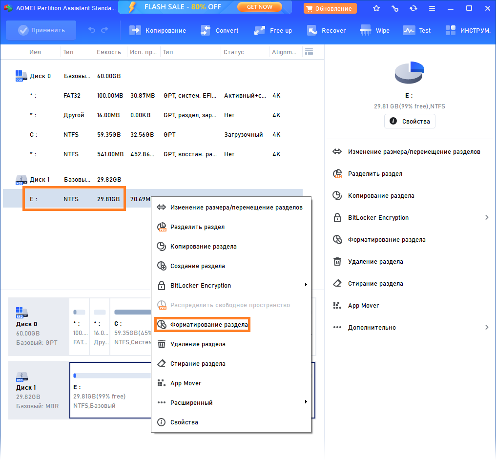
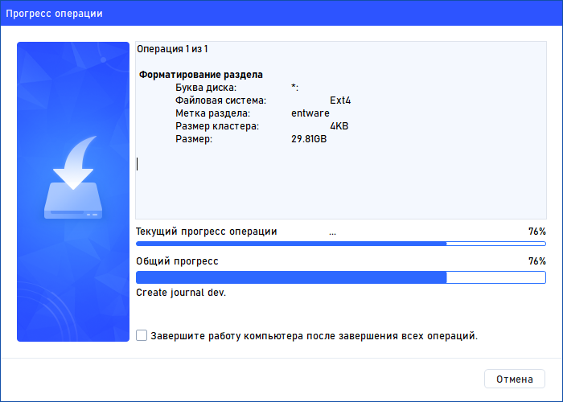
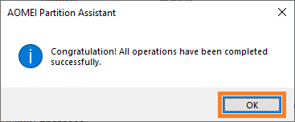
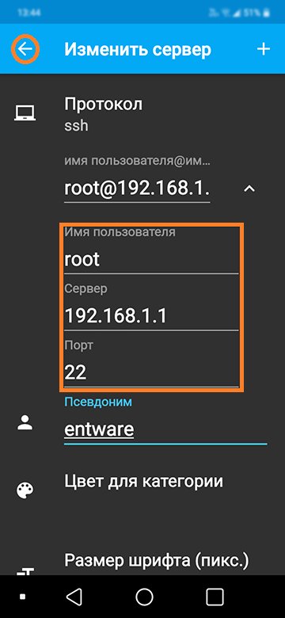
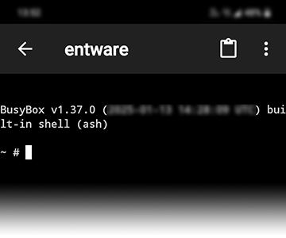

# NK для [NFQWS-Keenetic](https://github.com/Anonym-tsk/nfqws-keenetic)
Надстройка, позволяющая упростить и сделать максимально дружелюбным процесс установки и эксплуатации [NFQWS-keenetic](https://github.com/Anonym-tsk/nfqws-keenetic)...

### Для тех, кто начинает с самого начала
<details><summary>Подготовка интернет-центра</summary>

 > (всё об установке entware)

 ▪ Нам понадобится интернет-центр Keenetic (или ZyXEL Keenetic) с USB-портом(ами) и поддержкой работы с накопителями...

> За исключением моделей: 4G II, 4G III, а также бюджетных устройств - выпускаемых начиная с 2024-го года (USB-порт которых - поддерживает только работу с модемами, в связи с чем - в их прошивках отсутствуют компоненты для работы с накопителями (в том числе и со встроенным хранилищем)). Уточняйте поддержку соответствующих функций на [сайте производителя](https://keenetic.ru/ru/).

▪ Для начала, нужно определиться - где будет установлен entware: во встроенном хранилище или на USB-накопителе. Сам entware - занимает около 8-ми MB, нам также понадобится свободное место для установки различных пакетов...
- Встроенное хранилище - всегда с интернет-центром, не отключится (по каким-то своим причинам), не занимает USB-порт. Но - имеет существенные ограничения по объёму, и (теоретически) чувствительно к постоянной перезаписи данных (флеш-память имеет свойство изнашиваться, в связи с чем - крайне рекомендуется (по возможности) избегать ведение логов (с сохранением данных на встроенное хранилище))...
- USB-накопитель - может существенно превышать встроенное хранилище по объёму, может быть легко заменён (в случае каких-либо проблем). Но - занимает USB-порт, может быть медленнее встроенного хранилища (в зависимости от типа интерфейса/накопителя), может неожиданно оказаться отключенным (из за перегрева, механического воздействия или каких-то других причин)...
> USB-накопитель - желательно отформатировать в файловую систему ext4 ( под Windows, это можно сделать с помощью бесплатной [AOMEI Partition Assistant Standard Edition](https://www.aomeitech.com/pa/standard.html). В процессе форматирования, следует обязательно задать разделу на USB-накопителе, какую-нибудь метку тома (например "entware")...

<details><summary>(показать скриншоты)</summary>






</details>

▪ Посмотреть объём встроенного хранилища - можно в веб-конфигураторе (чтобы в него попасть - набираем в адресной строке браузера):

```
http://my.keenetic.net
```

или IP-адрес интернет-центра (в сегменте, к которому подключено ваше устройство). В "домашней сети" это обычно:

```
http://192.168.1.1
```

▪ В меню (слева) - выбираем: "Управление/приложения". Там, в разделе "Диски и принтеры" - отображаются все доступные накопители (в том числе и "Встроенное хранилище")...

<details><summary>(показать скриншот)</summary>

</details>

> Чем выше версия KeeneticOS - тем больше полезных функций она содержит. Для достижения наилучшего результата - рекомендуется обновить прошивку до версии - максимально близкой к актуальной...

<details><summary>Если версия KeeneticOS 3.x, на борту не менее 128 MB флеш-памяти а обновления - отсутствуют...</summary>

> (переходим в канал delta)

Для интернет-центров снятых с поддержки - выпускаются стабильные неофициальные обновления KeeneticOS в канале delta. Перейти в этот канал можно через CLI, или установив соответствующую версию KeeneticOS из файла.
 
> Перед тем как начинать переход в канал delta - настоятельно рекомендуется сохранить файлы: "firmware" и "startup-config" на странице "Управление/Параметры системы" в разделе "Системные файлы" (это позволит (при необходимости) вернуть состояние интернет-центра - в момент сохранения этих файлов).

▪ Для перехода в канал delta - открываем интерфейс командной строки интернет-центра:

```
http://my.keenetic.net/a
```

или

```
http://192.168.1.1/a
```

▪ Вводим в поле "Command" следующие команды:

```
components list delta
```

▪ Нажимаем кнопку "Send request" (дважды)...

```
system configuration save
```

▪ Нажимаем кнопку "Send request"...

```
components commit
```

▪ Нажимаем кнопку "Send request"...

<details><summary>(показать скриншоты)</summary>


</details>

▪ Последняя команда - запустит скачивание прошивки (из канала delta), по завершению которого - интернет-центр будет перезагружен.

> Поскольку прошивки из канал delta - не являются официальными, серьёзному тестированию (на устройствах - снятых с поддержки) они не подвергаются (в связи с чем - могут содержать различные мелкие ошибки). Но, польза от новых функций (в более поздних версиях KeeneticOS) - может намного превышать неудобства (связанные с этими ошибками).
</details>

<details><summary>Если версия KeeneticOS 2.x и обновления отсутствуют...</summary>

> (переходим на legacy-прошивку)
 
 Для старых моделей интернет-центров ZyXEL Keenetic, доступны неофициальные версии прошивок - содержащая массу полезных функций (отсутствующих в последних официальных стабильных сборках KeeneticOS для данных устройств).
 
 > Перед тем как начинать переход на legacy-прошивку - настоятельно рекомендуется сохранить файлы: "firmware" и "startup-config" на странице "Управление/Параметры системы" в разделе "Системные файлы" (это позволит (при необходимости) вернуть состояние интернет-центра - в момент сохранения этих файлов).

 ▪ Чтобы перейти на legacy-прошивку - открываем интерфейс командной строки интернет-центра:
 
```
http://192.168.1.1/a
```

И вводим в поле "Command" одну из следующих команд:

```
components sync legacy
```

> (для KeeneticOS до версии 2.06)

```
components list legacy
```

> (для KeeneticOS версии 2.06 и выше)

▪ Нажимаем кнопку "Отправить запрос".

▪ Затем, переходим в "Управление/Параметры системы", проверяем наличие обновлений KeeneticOS, и если таковые есть - устанавливаем их...
</details>

▪ Теперь нам нужно убедиться, что установлен компонент "Поддержка открытых пакетов" - переходим в "Управление/Параметры системы", нажимаем "Изменить набор компонентов"...

<details><summary>(показать скриншот)</summary>

</details>

▪ Вводим в поле "Поиск" (Поиск компонентов по имени):

```
Поддержка открытых пакетов
```

<details><summary>(показать скриншоты)</summary>


> Установленный компонент - может отображаться в списке как "Обязательный" (если он необходим для работы других - уже задействованных компонентов)...

</details>

▪ Если компонент не установлен - ставим флажок, нажимаем кнопку "Обновить KeeneticOS" и следуем инструкциям...

▪ Теперь можно перейти к установке entware...

<details><summary>Если entware устанавливается на встроенное хранилище а версия KeeneticOS 4.2 (и выше)...</summary>

> (устанавливаем entware через интерфейс командной строки интернет-центра)

▪ Открываем интерфейс командной строки:

```
http://my.keenetic.net/a
```

или

```
http://192.168.1.1/a
```

или

> Можно нажать на шестерёнку (в правом верхнем углу веб-конфигураттора), и выбрать пункт "Командная строка"...

▪ Вводим следующую команду:

```
show version
```

▪ Нажимаем кнопку "Отправить запрос"...

<details><summary>(показать скриншот)</summary>

</details>

> В отчёте (об установленной версии KeeneticOS) – будет строка: "arch": "*****" (где ***** - указание на архитектуру процессора: aarch64=aarch64, mips=mipsel).

<details><summary>(показать скриншот)</summary>

</details>

▪ Определившись с архитектурой - вводим в поле "Команда" одну из следующих команд:

```
opkg disk storage:/ https://bin.entware.net/mipselsf-k3.4/installer/mipsel-installer.tar.gz
```

> (Для архитектуры mipsel)

```
opkg disk storage:/ https://bin.entware.net/aarch64-k3.10/installer/aarch64-installer.tar.gz
```

> (Для архитектуры aarch64)

▪ Нажимаем кнопку "Отправить запрос"

<details><summary>(показать скриншот)</summary>

</details>
</details>

<details><summary>Во всех остальных случаях...</summary>

> (устанавливаем entware вручную)

▪ Открываем интерфейс командной строки:

```
http://my.keenetic.net/a
```

или

```
http://192.168.1.1/a
```

или

> (В веб-конфигураторе KeeneticOS версии 4.2 (и выше)) можно нажать на шестерёнку (в правом верхнем углу веб-конфигураттора), и выбрать пункт "Командная строка"...

▪ Вводим следующую команду:

```
show version
```

▪ Нажимаем кнопку "Отправить запрос"...

<details><summary>(показать скриншот)</summary>

</details>

> В отчёте (об установленной версии KeeneticOS) – будет строка: "arch": "*****" (где ***** - указание на архитектуру процессора: aarch64=aarch64, mips=mips или mipsel (к сожалению, в сети отсутствует полный список моделей Keenetic на архитектуре mips, так-что придётся воспользоваться интернетом - для выяснения архитектуры процессора конкретной модели интернет-центра)).

<details><summary>(показать скриншот)</summary>

</details>

▪ Скачиваем дистрибутив entware (соответствующий архитектуре процессора вашего интернет-центра):
- [mips](https://bin.entware.net/mipssf-k3.4/installer/mips-installer.tar.gz)
- [mipsel](https://bin.entware.net/mipselsf-k3.4/installer/mipsel-installer.tar.gz)
- [aarch64](https://bin.entware.net/aarch64-k3.10/installer/aarch64-installer.tar.gz)

▪ Переходим в "Управление/Приложения" (в веб-конфигураторе). В разделе "Диски и принтеры" - находим и открываем накопитель (на который будет устанавливаться entware)...

<details><summary>(показать скриншот)</summary>

</details>

▪ Выделяем раздел (в дереве папок) и нажимаем кнопку "Создать папку в выделенной папке"...

<details><summary>(показать скриншот)</summary>

</details>

▪ Создаём в корне диска папку:

```
install
```

> (все буквы в её имени - должны быть строчными)...

<details><summary>(показать скриншот)</summary>

</details>

▪ Выделяем папку "install" и нажимаем кнопку "Загрузить файл в выбранную папку"...

<details><summary>(показать скриншот)</summary>

</details>

▪ Находим в окне проводника и выбираем (скачанный ранее) архив (с дистрибутивом entware), чтобы поместить его в созданную папку...

<details><summary>(показать скриншот)</summary>

</details>

▪ Переходим в "Управление/OPKG", в меню "Накопитель" - выбираем диск (на который поместили дистрибутив entware), и нажимаем "Сохранить"...

<details><summary>(показать скриншот)</summary>

</details>

> Дожидаемся, когда побледневшая кнопка "Сохранить" полностью исчезнет…
</details>

▪ Переходим в "Управление/Диагностика", где нажимаем "Показать журнал".

<details><summary>(показать скриншот)</summary>

</details>

> В журнале (одно за другим) будут появляться события (связанные с установкой и настройкой различных компонентов entware), мы ждём события "Установка системы пакетов Entware - завершена"...

<details><summary>(показать скриншот)</summary>

</details>

> Теперь нам понадобится SSH-клиент...
</details>
</details>

<details><summary>SSH-клиент для ПК</summary>

> (устанавливаемм и настраиваем PuTTY) 

▪ [Скачиваем](http://www.putty.org/), устанавливаем и запускаем PuTTY...

▪ В поле "Host Name (or IP adress)" - вводим IP-адрес вашего маршрутизатора, обычно это:

```
192.168.1.1
```

▪ В поле "Port" - оставляем:

```
22
```

> (или "222", если до установки entware - в прошивке уже был установлен компонент "Сервер SSH")

<details><summary>(показать скриншот)</summary>

</details>

▪ Нажимаем кнопку "Open"...

> (При первом подключении) появится окошко с предупреждением - в котором нужно нажать "Accept".

<details><summary>(показать скриншот)</summary>

</details>
 
▪ Откроется окно терминала. На запрос имени пользователя (login as) - вводим:

```
root
```

▪ Нажимаем ввод...

▪ На запрос пароля (root@192.168.1.1's password) - вводим:

```
keenetic
```

> (при вводе пароля - символы отображаться не будут).

> Если у вас возникают сложности с вводом пароля - его можно скопировать из блокнота (или из этой инструкции) и вставить в окно терминала (кликом правой кнопки мыши)...

▪ Нажимаем "ввод"...

<details><summary>(показать скриншот)</summary>

</details>

▪ Если всё правильно - появится приглашение для ввода команд...

``
~ #
``

<details><summary>(показать скриншот)</summary>

</details>
</details>

<details><summary>SSH-клиент для смартфона</summary>

> (устанавливаем и настраиваем ConnectBot)

 ▪ Устанавливаем ConnectBot из [GooglePlay](https://play.google.com/store/apps/details?id=org.connectbot) или [RuStore](https://www.rustore.ru/catalog/app/org.connectbot) и открываем его...

▪ Нажимаем кнопку "+" (в нижней части экрана)...

<details><summary>(показать скриншот)</summary>

</details>

▪ Нажимаем на направленную вниз галку (справа от поля)...

<details><summary>(показать скриншот)</summary>

</details>

▪ Заполняем поля "Имя пользователя", "Сервер" и "Порт" - следующими данными:

Имя пользователя:

```
root
```

Сервер - адрес вашего интернет-центра (обычно это):
```
192.168.1.1
```

Порт:

```
22
```

> (или "222", если до установки entware - в прошивке уже был установлен компонент "Сервер SSH")

<details><summary>(показать скриншот)</summary>

</details>

▪ Нажимаем кнопку "Назад"...

▪ Возвращаемся к списку серверов и выбираем (добавленное) подключение...

<details><summary>(показать скриншшот)</summary>

</details>

▪ Соглашаемся "продолжить попытки соединений"...

<details><summary>(показать скриншот)</summary>

</details>

▪ Вводим пароль:

```
keenetic
```

<details><summary>(показать скриншот)</summary>

</details>

▪ Нажимаем ввод...

▪ Если всё правильно - появится приглашение для ввода команд...

``
 ~ #
 ``

<details><summary>(показать скриншот)</summary>

</details>
</details>

### Установка
Для того чтобы начать пользоваться NK - достаточно скопировать, и вставить в терминал - следующие несколько команд:

> В PuTTY это можно сделать - кликом правой кнопки мыши (по окну терминала), В ConnectBot - можно воспользоваться кнопкой "Вставить" (на верхней панели)...

```
opkg update;opkg install ca-certificates wget-ssl;opkg remove wget-nossl
wget -q -O /opt/bin/prs https://raw.githubusercontent.com/rino-soft-lab/ut/refs/heads/main/prs.sh
wget -q -O /opt/bin/nk https://raw.githubusercontent.com/rino-soft-lab/nk/refs/heads/main/nk.sh
chmod +x /opt/bin/prs /opt/bin/nk
prs -t "dns-https,dns-tls,ip6,opkg-kmod-netfilter,opkg-kmod-netfilter-addons" "dns" "nk"

```
<details><summary>Что делают все эти команды?</summary>

> (построчный разбор)

- Строка 1: обновление списка доступных пакетов, установка набора доверенных корневых сертификатов и пакета wget (с поддержкой ssl - который поможет скачать файлы из этого репозитория), удаление пакета wget (без поддержки ssl - если таковой был установлен).
- Строка 2: Скачивание скрипта pre-Setuo
- Строка 3: Скачивание скрипта NK
- Строка 4: Установка разрешения на выполнение обоих скачанных файлов
- Строка 5: Запуск скрипта pre-Setup (с необходимыми параметрами).
</details>

> Скрипт pre-Setup - проверит наличие всех необходимых компонентов (если какие-то из них отсутствуют - они будут установлены, а интернет-центр - перезагружен). После полной загрузки интернет-центра - нужно заново подключиться к entware, и запустить скрипт pre-Setup ещё раз (для этого - нужно ввести в терминал):

```
prs
```

> и нажать ввод. Скрипт проверит - все ли компоненты установились и (при необходимости) скорректирует настройки, после чего - будет запущен NK:


> Когда он понадобится вам в следующий раз - достаточно будет ввести в терминал:

```
nk
```

> И нажать "ввод"...

<details><summary>Что можно сделать с помощью NK...</summary>

> (краткая демонстрация некоторых возможностей) 

#### Можно изменить какую-нибудь настройку (например "режим работы")...

▪ В главном меню - выбираем "Редактор конфигурации" (5)


▪ В редакторе - выбираем "Переключаемые параметры" (9)


▪ В меню "Переключаемые параметры" - выбираем "Режим работы" (1)


 
▪ В меню "Режим работы" - выбираем "Список" (2)


> Обратите внимание: перед параметром "NFQWS_EXTRA_ARGS" отвечающим за режим "auto" - появился коментирующий символ "#", а у аналогичного параметра, отвечающего за режим "list" - он исчез...

▪ Сохраняем изменения (1), перезапускаем службу (1)...

> При каждом сохранении файла конфигурации, NK - делает резервную копию его предыдущей версии, помещая её в папку с текущей датой и временем в названии (чтобы иметь возможность быстро восстановить предыдущее состояние)...

#### Можно добавлять/удалять доменные имена (в одном из файлов-списков)...

▪ В главном меню - выбираем "Редактор списков" (7)


 
▪ В меню - выбираем один из списков (например) "user.list" (3)


▪ В редакторе выбираем "Добавить элементы" (2), и последовательно добавляем желаемые домены. Чтобы завершить добавление - нажимаем "ввод" (оставив поле пустым)...


 
▪ Если есть необходимость удалить доменные имена из списка - выбираем "Удалить элементы", вводим последовательность символов (соответствующую записям - которые нужно удалить), убеждаемся что среди найденых строк - нет лишних,  и соглашаемся на их удаление (1)


▪ Завершив редактирование списка - сохраняем его (1), и перезапускаем службу (1)...

> При каждом сохранении файлов списков, NK - делает резервные копии их предыдущих версий, помещая их в папку с текущей датой и временем в названии (чтобы иметь возможность быстро восстановить предыдущее состояние)...

#### Ключи.

NK - поддерживает работу с ключами (что позволяет выполнять некоторые действия без использования начального меню). Например:

````
nk -r
````
Перезапустит службу NFQWS (для применения новых настроек).
> Что существенно удобнее и быстрее - чем каждый раз набирать "/opt/etc/init.d/S51nfqws restart"...

Ниже приведён список ключей и их описание:

- -a: Вывод в терминал архитектуры процессора - на котором выполняется сценарий.
- -A: Установка пакета NFQWS-Keenetic для архитектуры aarch64
- -b: Резервное копирование/восстановление файлов профиля (конфигурация, списки и т.п.)
- -B: Настройка кнопок маршрутизатора (для управления службой NFQWS)
- -с: Редактор конфигурации
- -f: Имитация первого запуска (диалог быстрой установки NFQWS-keenetic)
- -i: Информация об установленном пакете NFQWS-Keenetic
- -I: Установка универсального пакета NFQWS-Keenetic
- -l: Редактор списков
- -m: Установка пакета NFQWS-Keenetic для архитектуры mips
- -M: Установка пакета NFQWS-Keenetic для архитектуры mipsel
- -o: Оптимизация профиля (помогает избавиться от лишних файлов и восстановить некоторые параметры - после обновления NFQWS-Keenetic)
- -p: Запуск NK без проверки наличия обновлений NFQWS-Keenetic
- -P: Управление политикой доступа
- -r: Перезапуск службы NFQWS
- -R: Удаление пакета NFQWS-Keenetic
- -s: Остановка службы NFQWS
- -S: Запуск службы NFQWS 
- -u: Обновление скрипта NK (до последней версии)
- -U: Обновление пакета NFQWS-Keenetic
- -v: Вывод в терминал текущей версии NK 
- -W: Установка Web-интерфейса NFQWS-Keenetic
- -z: Донастройка интернет-центров ZyXel Keenetic (с KeeneticOS 2.x, в которых недоступны DoT и DoH)

#### P.S.
Если после установки NFQWS-Keenetic, у вас возникли проблемы с основным функционалом пакета - обратитесь к разделу:  (на странице разработчика)...
</details>
